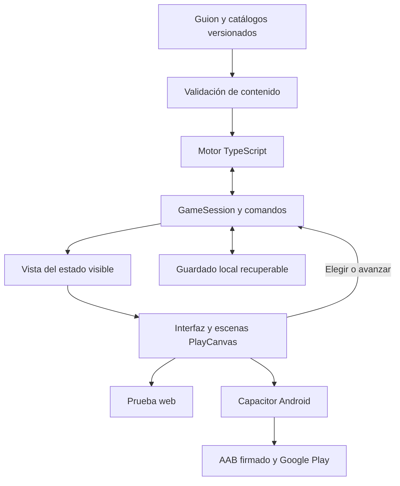

# Viabilidad y plan de ingeniería de Carrera de Futbolista

Fecha de referencia: 11 de septiembre de 2026. Motor examinado: v0.8.0. Guion: Documento Maestro v0.9, pasada 8. Estado de este documento: propuesta de línea base para ejecución, pendiente de ajustar capacidad y diseño de interfaz.

## Dictamen

El proyecto es técnicamente viable como juego narrativo de carrera futbolística para Android. Recomiendo conservar el motor TypeScript, ensayar PlayCanvas como presentación y empaquetar una aplicación con recursos locales mediante Capacitor. La prioridad debe ser transformar la simulación en una experiencia que permita decidir, percibir consecuencias y retomar la partida sin perder nada.

El motor ya resuelve una parte difícil: produce carreras completas reproducibles. Sin embargo, **no considero demostrado que esté terminado como motor de producto ni que el contenido del guion esté íntegramente implementado**. Hay diferencias importantes entre los recuentos de eventos y su fidelidad, entre definir memoria y utilizarla, y entre generar etiquetas finales y contar un epílogo satisfactorio. El mayor riesgo actual es dedicar meses a embellecer escenas demasiado repetidas.

El guion tiene una identidad fuerte: el jugador puede construir una vida deportiva reconocible sin que ganar títulos sea la única forma de satisfacción. Las relaciones interesadas, las decisiones ambiguas, el origen en Valdoria y las consecuencias diferidas pueden distinguirlo. Ese potencial todavía necesita una prueba con jugadores. No hay evidencia suficiente para asignarle una nota de diversión, prometer ventas ni afirmar una duración real de ocho a catorce horas.

Propongo una primera versión con carrera completa, español, juego individual, guardado local y presentación 2D con ambientación contenida. Los partidos se simulan y se presentan mediante momentos relevantes; no se presupuesta un simulador de fútbol controlado en tiempo real. El objetivo final incluye publicación en Google Play y un periodo de estabilización de 14 días.

## Alcance y calidad de la evidencia

Se ha extraído el cuerpo y las 401 tablas del DOCX, conservando el orden de sus bloques. Se renderizaron sus 258 páginas y se inspeccionaron visualmente páginas representativas de escenas y del contrato final. Se han revisado las reglas de diseño, universo, inventario de edades, contrato técnico, densidad, memoria, finales y ejemplos de escenas a través de las edades; se han comparado automáticamente los 254 identificadores de principales en encabezados con el catálogo del motor. Esta es una auditoría de arquitectura y de implementación, **no una certificación editorial de las 388 escenas palabra por palabra**.

Las instrucciones de trabajo que aparecen dentro del documento se han tratado como contenido de la especificación aportada, no como autorización para ejecutar las acciones que describe. La referencia de producto usada es la revisión final de la sección 26. Por ejemplo, la aspiración inicial de 650–900 escenas de la sección 19.10 no se suma al inventario final de 388 eventos de la pasada 8.

Se han leído los módulos centrales, los generadores de contenido, los validadores y los scripts de QA. Se compiló el proyecto con TypeScript 5.8.3 a una carpeta de auditoría: cero errores y ninguna diferencia entre los JavaScript producidos y los entregados en `dist`. La revisión usa 61 archivos TypeScript, aproximadamente 4.472 líneas y 460 KB de fuente; el formato de muchas líneas es muy compacto, por lo que las líneas no son una medida de completitud.

Se conservaron el código original y los informes originales. Las pruebas nuevas y sus resultados están en esta carpeta. Los archivos de QA históricos documentan 1.000 carreras; **no se ha repetido íntegramente esa batería de 1.000 en esta auditoría**. Sí se han ejecutado 90 carreras nuevas y pruebas específicas de determinismo, migraciones, reanudación y entradas inválidas.

Se consultó la vista general del proyecto de PlayCanvas. Figura creado el 11 de septiembre, derivado de Blank Project, público y con 2,36 MB. Esto confirma el espacio de trabajo; no acredita integración del motor ni una interfaz terminada. La interfaz que se aportará después queda pendiente de evaluación visual y de usabilidad.

## Resultados comprobados

| Prueba | Resultado | Qué demuestra y qué queda abierto |
|---|---|---|
| Compilación desde fuente | Correcta y equivalente a `dist` | Base técnica coherente; no valida reglas narrativas |
| Validador actual del catálogo | Cero incidencias | Los controles implementados pasan; faltan controles relevantes |
| 30 carreras con elecciones aleatorias | 30 terminadas | Nuevas semillas 910000–910029; media 162,5 eventos y retirada a 42,2 años |
| 30 carreras eligiendo siempre la primera opción | 30 terminadas | Prueba de estrés posicional; no representa una personalidad |
| 30 carreras con estrategia `balanced` | 30 terminadas | El código elige la opción central; no es una estrategia equilibrada semántica |
| Dos ejecuciones de la semilla 424242 | Estado completo idéntico | Determinismo comprobado para ese escenario |
| Con y sin microfeeds | Misma narrativa y epílogo | Independencia comprobada para esa semilla |
| Serialización y carga del estado v8 | Equivalencia completa | Conversión JSON correcta para un estado válido |
| Ejemplos de guardado v3, v4, v5, v6 y v7 | Migran a v8 conservando history y seeds | Un ejemplo por versión; no cubre toda combinación posible ni v2 |
| Guardar al día 850 y continuar otros 850 días | Estado idéntico al continuo | Reanudación correcta en una frontera diaria con política fija |
| Eliminar history y retirement de un save v8 | La carga lo acepta | La validación del guardado es insuficiente |
| Aplicar dos veces una misma decisión | Se registran ambas | Falta una sesión que rechace comandos repetidos |
| Consultar dos veces el scheduler | Consume dos tiradas RNG | La UI necesita persistir el evento pendiente y no recalcularlo |
| Catálogo con edad imposible, choice duplicada y ruta numérica inexistente | El validador no los detecta | Hay falsos negativos en el control de calidad |

La prueba de doble resolución ejercita una API de bajo nivel. No demuestra un fallo de una interfaz existente; demuestra que conectarla directamente a botones dejaría sin protección un caso normal de móvil. Lo mismo sucede con el scheduler: consumir azar al seleccionar es razonable, pero consultar la pantalla no debe volver a seleccionar.

Las 1.000 firmas únicas del QA histórico incluyen fechas, IDs, decisiones y desenlaces. Es una prueba útil contra recorridos idénticos, pero no mide cuántas historias percibe el jugador como distintas. Tampoco equivale a recorrer todas las ramas. El informe v8 de 1.000 carreras verifica explícitamente cobertura del bloque 34+ y familias de final; no aporta por sí solo cobertura actual de todas las decisiones y outcomes de todas las edades.

## Fidelidad del contenido y atractivo actual

| Tramo | Eventos | Marcados verified | Marcados technical adaptation | Cuerpos de escena distintos | Juegos de opciones distintos | Eventos con NPC explícitos |
|---|---:|---:|---:|---:|---:|---:|
| 18–20 | 44 | 12 | 32 | 44 | 44 | 39 |
| 20–23 | 51 | 10 | 41 | 12 | 2 | 0 |
| 23–26 | 60 | 25 | 35 | 26 | 28 | 0 |
| 26–30 | 75 | 16 | 59 | 2 | 5 | 0 |
| 30–34 | 76 | 6 | 70 | 3 | 3 | 0 |
| 34+ | 82 | 9 | 73 | 6 | 13 | 0 |
| Total | 388 | 78 | 310 | — | — | 39 |

Los recuentos de cuerpos y opciones comparan cadenas exactas dentro de cada tramo. No miden automáticamente calidad ni equivalencia semántica. Sí muestran una repetición muy superior a la diversidad que promete la biblioteca. **310 de 388 eventos, el 79,9 %, están etiquetados como adaptaciones técnicas**. El 20,1 % restante tampoco puede asumirse completamente reconciliado solo por la etiqueta.

Un ejemplo representativo es `EVT_21_PRS_001`, La cifra publicada. El guion propone desmentir con la cifra exacta, negar sin dar números, no corregir o pedir al club que rectifique. La implementación conserva un contexto similar y la marca `verified`, pero genera opciones genéricas como tomar la iniciativa o proteger tu posición. Estas opciones pierden parte del dilema sobre verdad, privacidad y negociación.

En 26–30, 51 eventos comparten exactamente el cuerpo introductorio. En 30–34, 49 comparten otro. Variar títulos y pequeños modificadores no basta para sostener varias horas de lectura. El primer tramo posee escenas mucho más específicas y constituye la mejor base para una demostración.

De los 254 IDs de principales del guion, **87 no coinciden literalmente con ningún ID del catálogo**. Algunos pueden corresponder a renombrados o adaptaciones; el dato no significa que falten exactamente 87 historias. Exige una tabla de correspondencias guion → evento → decisiones → consecuencias y una migración si se cambian IDs utilizados en guardados. Igualar el número total de eventos no acredita equivalencia.

El problema de contenido incluye comportamiento. Solo tres eventos declaran modificadores de peso de outcome. Gran parte de los dilemas anteriores a 34 usan la plantilla 55/45; en los 82 eventos de 34+ cada opción referencia un único outcome. Elegir una acción factual puede ser determinista, pero las reacciones inciertas requieren probabilidades dependientes del contexto. Las condiciones del scheduler no sustituyen esa dependencia en el resolver.

## Riesgos técnicos prioritarios

### Memoria y personajes

El resolver soporta crear, activar, intensificar, transformar, resolver y expirar semillas. Sin embargo, el catálogo declara 1.236 transiciones de creación y **ninguna de los otros cinco tipos**. Son apariciones de transiciones en outcomes, no 1.236 semillas únicas. En las 90 carreras nuevas no se resolvió ninguna seed por ese ciclo de vida.

176 de las 210 definiciones no tienen lector explícito en `seedsRead`. Este recuento no excluye lecturas indirectas por flags o variables y no permite declararlas todas huérfanas. Sí impide dar por validada la promesa de consecuencias diferidas. El epílogo tampoco recorre las instancias de seeds para darles una salida narrativa individual.

Existen catálogos de NPC y relaciones con varios ejes. Desde los 20 años los eventos no declaran `npcRefs`; los campos de agenda, conocimiento, fiabilidad y memorias no tienen en los módulos revisados un proceso de evolución comparable a lo especificado. Algunas relaciones tempranas sí influyen por rutas de estado. Hay estructura útil, pero no una simulación completa del reparto persistente.

La solución propuesta es elegir primero cinco cadenas causales importantes —Nano, agente, Paula, Clara y regreso a Valdoria— y cerrar creación, persistencia, cambio de contexto, callback y salida de epílogo. Después se aplica la misma metodología a todo el registro. Un callback debe cambiar una posibilidad, el sentido de una conversación o una consecuencia; mencionar el pasado sin efecto no basta.

### Autoridad sobre las decisiones

`professionalWeek` puede renovar automáticamente contrato y salario antes de los 34 años. Es útil para mantener viva una simulación, pero una partida debe distinguir oferta, consejo, decisión, plazo y firma. La renovación se convierte en propuesta pendiente, o en una delegación que el jugador haya elegido expresamente. También deben revisarse cambios automáticos de club y cesiones bajo esa misma regla.

`CEVT_RET_STORYBOOK_LAST_GOAL` marca el gol de despedida y el cierre al escoger jugar el momento; no resuelve ese gol con RNG deportivo. Es un caso concreto en que la decisión narrativa determina el resultado que el guion establece como incierto. Debe producir intención y oportunidad, y dejar la resolución deportiva a su sistema correspondiente.

### Continuidad de sesión y guardado

Se necesita un `GameSession` entre interfaz y motor. Guardará evento pendiente, revisión del estado, identificador del último comando, mensajes pendientes y RNG ya consumido. La operación elegir debe validar el evento pendiente y aplicar efectos exactamente una vez, incluso tras doble toque, pausa o recuperación.

El formato de guardado necesita validación completa, escritura transaccional o recuperación equivalente, copia anterior válida y pruebas de interrupción. Debe versionar esquema, contenido y motor por separado. La versión del esquema no basta si cambian IDs, gates o reglas entre actualizaciones.

### Epílogo y final de carrera

Todos los eventos resueltos reciben saliencia 70. El generador elige muestras espaciadas y produce hitos del tipo temporada, ID y choice. Todavía no hay una narración final lista para el jugador, una selección real por relevancia causal ni una matriz explícita de compatibilidad entre familias.

La clasificación de edades también merece una corrección: al terminar `simulateCareer` recalcula estados de 20, 23, 26, 30 y 34 sobre el estado final y reescribe `careerStateTags`. El simulador de mundo conserva algunos hitos en `world`, pero el resultado final puede presentar como clasificación histórica una lectura realizada años después. Deben fijarse las instantáneas al cruzar cada frontera.

El scheduler limita a 20 los principales ordinarios del tramo 34+, además de otros límites. Aunque el índice admite edades abiertas, el presupuesto puede agotarse. En las 30 carreras aleatorias nuevas, las que alcanzaron principales ordinarios 34+ terminaron de media 4,2 años después del último de esos eventos; el máximo fue 10 años. Puede seguir habiendo condicionales, feeds o escenas terminales: **no son necesariamente diez años sin ningún contenido**, pero sí una señal clara para revisar la etapa final.

El QA histórico concentra el 35,4 % de retiradas a los 42 años y presenta un 76,3 % de cierres sin último partido. No impongo otra distribución como si fuera un dato real del fútbol. Son alarmas de balance del propio diseño que requieren medir la experiencia y rastrear sus causas. Mantener una retirada sin edad fija es compatible con reducir años de escaso interés mediante elipsis y ventanas significativas.

### Pruebas y mantenibilidad

`final-gate-v08.mjs` escribe `passed`, pero no hace fallar el proceso cuando el resultado es falso. El agregador tiene un problema equivalente. Una integración continua puede mostrar verde aunque el JSON diga lo contrario. Deben devolver un código de error y comprobarse mediante pruebas deliberadamente fallidas.

Faltan validadores de contradicciones en gates, rutas de efectos, diversidad de opciones, consumo de semillas, correspondencia con canon y compatibilidad de finales. La validación de presentación tampoco comprueba que los archivos de imagen existan. El manifiesto genera rutas dentro de `18_20` para todos los eventos y es una previsión de recursos, no una biblioteca multimedia entregada.

Hay interfaces TypeScript valiosas, pero también bastantes `any`, rutas dinámicas sin tipar, flags como cadenas y código muy comprimido. La refactorización debe concentrarse en contratos de datos y módulos que se vayan a cambiar. No recomiendo reescribir todo para mejorar estilo ni cambiar el RNG durante una optimización sin pruebas de reproducción.

## Eficiencia y límites de rendimiento

| Medición local | Valor observado | Interpretación |
|---|---:|---|
| JavaScript del motor compilado | 462.605 bytes | Base pequeña; no incluye PlayCanvas ni recursos audiovisuales |
| 90 carreras nuevas | 26,4 s sumando las tres tandas | Unos 293 ms por carrera en media global |
| Ejemplo completo de 424242 | 413 ms en la primera medición | Incluye arranque y calentamiento; no es una latencia móvil |
| Guardado del ejemplo | 90.076 bytes | Historial, RNG y microfeeds caben holgadamente en almacenamiento local |
| Mayor guardado de las 90 carreras | 101.966 bytes | No hay una necesidad de base de datos remota demostrada por tamaño |
| Clonar un estado tardío | p95 1,37 ms | Puede encarecer grandes avances si se hace cada día |
| Serializar ese estado | p95 0,42 ms | No mide escritura a disco ni durabilidad |
| Avanzar un día por API inmutable | p95 1,44 ms | Incluye copia; no simular miles de días bloqueando la UI |

Entorno: macOS, Intel Core i5-1038NG7 a 2 GHz, Node 24.19.0. Micropruebas de cien repeticiones, sin renderizado ni teléfono. Las cifras son observaciones, no compromisos para Android. La prueba denominada `mutableAdvanceLate` en el JSON también incluye la copia de preparación; no se usa para afirmar una aceleración del camino mutable.

El scheduler recorre el historial al preparar cada tick y luego los candidatos de la fase. Con cientos de eventos es un coste aceptable en la muestra. Crecer contenido, imágenes y efectos puede cambiarlo. El índice de edad almacenado se construye pero no se utiliza para seleccionar candidatos; su optimización tiene prioridad menor que los problemas de producto.

Recomiendo avanzar hasta la siguiente decisión relevante por tramos, mantener los cambios dentro de una sesión, notificar a la UI una vez por transición y usar un Web Worker si el perfilado del teléfono muestra tareas largas. El ahorro mayor puede venir de no renderizar continuamente escenas estáticas, pausar al ir al fondo y limitar texturas y vídeos.

Presupuestos iniciales de aceptación, a validar en T3: respuesta visible al toque p95 menor de 100 ms, siguiente escena p95 menor de 200 ms, entrada en partida guardada menor de 3 s en un Android de gama media, arranque frío menor de 5 s, al menos 30 fps en animaciones y 60 fps como objetivo en desplazamiento de texto. Perfil de prueba de treinta minutos sin crecimiento de memoria sostenido mayor del 10 % después del calentamiento. Son objetivos de ingeniería propios, no umbrales de Google.

Para la v1 se propone una descarga inicial de menos de 80 MB y recursos de arranque de menos de 15 MB, evitando cargar toda la biblioteca de imágenes a la vez. Los límites se revisarán con el arte real. La batería requiere ensayo físico con brillo y condiciones fijas; no puede deducirse del tamaño de JSON.

## Cómo convertirlo en un juego atractivo

La promesa central debería poder explicarse así: construir la carrera de tu futbolista y convivir con lo que decidió años atrás. El público inicial a probar es quien disfruta el fútbol, la gestión y las historias personales; no debe venderse como un juego de habilidad de partidos completos si esa mecánica no existe.

El ciclo propuesto es consultar una situación comprensible, elegir una prioridad, ver un momento deportivo o personal, recibir una consecuencia y reconocer más adelante su huella. Cada sesión de cinco a diez minutos debe permitir una decisión significativa y un punto seguro de salida. La duración de una carrera se medirá aparte.

El documento fija ocho a catorce horas por carrera. Con unas 120–175 decisiones fuertes y condicionales en conjunto, uno o dos minutos por decisión producirían aproximadamente dos a seis horas; el resto exigiría gestión o fútbol que hoy no están acreditados como experiencia jugable. No se alargará artificialmente el calendario para alcanzar una cifra. La demo medirá lectura, navegación, partido y espera por separado; después se conserva la ambición original o se registra un cambio de objetivo de duración.

La presentación debe mostrar estado físico, rol, contrato, calendario y personas relevantes sin convertir al jugador en lector de decenas de barras. Los hechos contractuales conocidos se muestran con claridad; las probabilidades, agendas y variables ocultas se traducen a señales. Los porcentajes de gestión del proyecto no aparecerán como probabilidades de éxito dentro del juego.

La demostración tendrá de ocho a doce decisiones específicas que enseñen contraste: Nano, una presión del veterano, una elección médica, una negociación y un momento deportivo. Incluirá al menos una consecuencia diferida visible dentro de la sesión y otra que quede abierta. Se medirá si el usuario entiende la causa, incluso cuando no le gusta el desenlace.

Criterios iniciales para ocho a doce participantes del público objetivo: al menos el 80 % comienza y toma tres decisiones sin ayuda; al menos el 70 % explica una relación entre elección y consecuencia; al menos el 60 % elige voluntariamente continuar tras quince o veinte minutos. Con diez personas, una persona cambia diez puntos: son señales de diseño, no estimaciones poblacionales ni garantía comercial. Una opción elegida por más del 65 % se investiga antes de alterar su balance.

El cierre de carrera merece el mismo cuidado que el inicio: texto legible, doce a veinte hitos con causa y fechas, personajes que recuerdan, contraste entre éxito deportivo y vida personal, y una invitación a explorar otra carrera sin etiquetar la anterior como fracaso por no ganar títulos.

## Decisión tecnológica

| Opción | Encaje con el motor | Trabajo online | Valor para este juego | Coste o condición |
|---|---|---|---|---|
| PlayCanvas y Capacitor | Alto al conservar JavaScript | Editor visual online | Preferida por el autor; buena opción para ambientación, animación y futura dimensión 3D | Requiere integración, empaquetado Android y ensayo de lectura y rendimiento |
| Interfaz web HTML y CSS con Capacitor | Muy alto | Posible con un entorno de desarrollo web online | Alternativa más directa si predomina texto, agenda y gestión | Menos herramientas visuales de escenas; habrá que escoger ese entorno de trabajo |
| Construct 3 | Posible mediante adaptación JavaScript | Editor y servicio de compilación online | Interesante si prevalecen minijuegos 2D y edición visual | Introduce otra capa de eventos y adaptación; no se presupone un ahorro con el motor actual |

**Decisión recomendada: PlayCanvas como candidato principal, con una salida alternativa clara si falla la prueba.** La preferencia del usuario tiene valor y no hay motivo para cambiar de herramienta por moda. La documentación confirma editor online, pruebas en dispositivos y publicación web. [PlayCanvas Editor](https://playcanvas.com/products/editor).

Para pantallas de lectura propondría ensayar HTML y CSS sobre la escena de PlayCanvas, con actualizaciones solo cuando cambia el estado. La documentación admite ese uso y señala posibles costes del DOM en aplicaciones de renderizado intenso. También permite UI con Screen y Element. Se decidirá con una pantalla real de texto largo, desplazamiento y accesibilidad, no solo con una captura bonita. [Interfaz de PlayCanvas](https://developer.playcanvas.com/user-manual/user-interface/).

PlayCanvas publica contenido web; llevarlo a una tienda móvil exige una aplicación contenedora o solución equivalente. Su documentación enumera Cordova, GoNative y WebView con recursos locales. **Capacitor es mi propuesta de arquitectura**, sustentada en su soporte de juegos web y Android; no lo presento como el empaquetador recomendado expresamente por PlayCanvas. [Publicación móvil de PlayCanvas](https://developer.playcanvas.com/user-manual/editor/publishing/mobile/), [juegos con Capacitor](https://capacitorjs.com/docs/guides/games), [Capacitor para Android](https://capacitorjs.com/docs/android).

Construct es una alternativa online real, con JavaScript y compilación móvil. Su existencia no justifica portar el motor antes de comprobar el camino preferido. [Editor de Construct](https://www.construct.net/en/make-games/manuals/construct-3/getting-started/get-construct-3), [capacidades de Construct 3](https://www.construct.net/en/make-games/new-features).

El plan gratuito de PlayCanvas ofrece proyectos públicos y alojamiento. El plan Personal figura a 15 USD al mes para proyectos privados; verificar importe y condiciones al contratar. El proyecto observado está actualmente público. Esto es una decisión concreta de producción que hay que resolver antes de subir el guion completo o materiales aún no destinados a publicación. [Planes de PlayCanvas](https://playcanvas.com/plans).

## Arquitectura de la aplicación

El motor sigue siendo un paquete independiente. La UI no modifica directamente contratos, RNG o flags; envía comandos. `getViewModel` expone solo información conocida por el protagonista. Los recursos audiovisuales se resuelven por IDs y disponen de una alternativa local cuando fallan.

Contrato orientativo de sesión: `newCareer`, `getViewModel`, `advanceUntilDecision`, `choose(pendingEventId, choiceId, commandId, revision)`, `save` y `restore`. La API exacta se cerrará en T2. No es una implementación existente.

En navegador se utilizará almacenamiento transaccional apropiado, por ejemplo IndexedDB; en Android, un adaptador de almacenamiento local con recuperación verificada. La elección entre archivo privado y base de datos depende del ensayo de interrupción, no del tamaño del catálogo. Preferencias de sonido y lectura quedan separadas de partidas. Los saves conservan información oculta, pero esa información no se entrega a componentes de pantalla.

Ruta de producción: fijar dependencias y versión del motor; generar el paquete JavaScript; integrar el adaptador en PlayCanvas; exportar la aplicación web completa; verificar rutas relativas y recursos locales; sincronizar con Capacitor; compilar Android; firmar un AAB; probar por el canal interno; pasar a beta cerrada y finalmente producción. Cada entrega debe identificar versión de fuente, contenido, exportación y aplicación.

El trabajo visual puede ser online, pero el build Android requiere herramientas Android. Puede ejecutarse en un equipo configurado o en un servicio de integración continua online; PlayCanvas por sí solo no elimina ese paso. La ruta de compilación se comprueba en T3; la identidad y la firma de distribución se completan en T8. No se añaden servicios de servidor ni generación de texto por IA en tiempo de ejecución a esta v1: la biblioteca actual permite una experiencia local sin ese coste operativo.

## Objetivo final y límites de la primera versión

Se considerará alcanzado el objetivo cuando exista una app Android instalada desde Google Play en la región acordada, que permita crear un futbolista, completar su carrera, guardar y reanudar, recibir un epílogo comprensible y comenzar otra partida; con recursos y textos aprobados, pruebas físicas, documentación de publicación y seguimiento inicial de producción durante 14 días.

La línea base cubre español, un jugador, clubes ficticios, carrera completa, biblioteca de 388 eventos reconciliada o con desviaciones explícitamente aceptadas, 210 semillas con destino trazable, 20 NPC con uso definido, veinte familias finales, modo offline y pantallas adaptables. La personalización inicial será acotada a identidad y retrato; un editor 3D de personaje alteraría el alcance.

No se presupuestan partidos completos controlables, multijugador, mundo 3D explorable, doblaje integral, clubes licenciados, iOS, traducciones, comunidad, nube o tienda de compras dentro del juego. No son descartes de futuro: incorporarlos requiere pasadas, dependencias y criterios propios. Un juego de fútbol en tiempo real sería un proyecto adicional significativo, no una pequeña mejora de la presentación.

El alcance de la UI permanece provisional hasta recibir los materiales. La demo permitirá estabilizar el contrato de pantallas sin dar por aprobado su aspecto definitivo.

## Plan vigente por pasadas del asistente

Revisión 6, por instrucción del autor. La estimación anterior de dedicación humana queda sustituida por una línea base de **68 pasadas del asistente**, con rango inicial **55–87** y reserva de **14** para correcciones del alcance previsto. Se recalibra con implementación comprobada; no se presupone velocidad fija de la IA.

**T1, T2.1, T2.2, T2.3 y T3.1 completadas: 15,35 % del plan posterior a T0. Quedan 63 pasadas base.** Este porcentaje mide entregables ponderados de T1–T9, no porcentaje de fidelidad, diversión ni madurez del motor existente. T1 produjo alcance y contrato, doce comparaciones de escenas, inventario de 254 principales y planificación. T2.1 añadió sesión interactiva y visor local; T2.2 incorporó validación de guardados y migraciones. T3.1 integra la interfaz del handoff en PlayCanvas y verifica elección, recarga e historial. La siguiente pasada es T2.4.

La demo Android corresponde al cierre de T3, tras diez pasadas contando T1, condicionada a herramientas y prueba física. Las verificaciones humanas y la revisión de tienda son dependencias externas; no se convierten en pasadas de ejecución.

- [Plan completo y criterios por pasada](/Users/capitanps/Downloads/multihistoria-engine-v0.8/project/PLAN_PASADAS.md)
- [Alcance Android y contrato de integración T1](/Users/capitanps/Downloads/multihistoria-engine-v0.8/project/T1_ALCANCE_Y_CONTRATO.md)
- [Auditoría piloto y reparaciones definidas](/Users/capitanps/Downloads/multihistoria-engine-v0.8/project/T1_AUDITORIA_12_ESCENAS.md)
- [Seguimiento estructurado vigente](/Users/capitanps/Downloads/multihistoria-engine-v0.8/analysis/2026-09-11/plan-seguimiento.json)

Los pesos de las etapas se conservan por continuidad: 6, 11, 11, 11, 33, 11, 8, 7 y 2 %. Cada subpasada gana su peso solo cuando cumple sus criterios. Dos pasadas consecutivas sin cerrar su entrega o una previsión que crezca más del 20 % exigen revisión documentada. La versión anterior se conserva únicamente como historial en `history/revision-1-*`.

## Condiciones de Android y costes operativos

La documentación oficial consultada exige, desde el 31 de agosto de 2026, que las apps nuevas y actualizaciones móviles generales apunten a Android 16, API 36, o posterior. Se volverá a comprobar al preparar la entrega. El nivel objetivo no es la versión mínima instalable. La versión mínima de producto se decide después de T3 y la matriz física, tomando en cuenta también el soporte real de PlayCanvas y WebView. [Requisitos de nivel de API](https://developer.android.com/google/play/requirements/target-sdk?hl=es-419).

Capacitor v8 documenta soporte Android API 24+ y uso de Android Studio. Eso no demuestra que toda combinación de WebView y hardware compatible con Capacitor satisfaga este juego. [Soporte Android de Capacitor](https://capacitorjs.com/docs/android).

Para cuentas personales de desarrollador creadas después del 13 de noviembre de 2023, Google exige una prueba cerrada con al menos doce participantes inscritos continuamente durante catorce días antes de solicitar acceso a producción. Solicitar acceso no equivale a aprobación automática. El reclutamiento debe empezar en T4, con margen para bajas. [Requisitos de pruebas de Google Play](https://support.google.com/googleplay/android-developer/answer/14151465?hl=es-us).

La entrega de tienda se prepara como Android App Bundle firmado, con versión creciente y ficha completa. [Configuración y publicación de apps](https://support.google.com/googleplay/android-developer/answer/9859152?hl=es), [publicación con Capacitor](https://capacitorjs.com/docs/android/deploying-to-google-play).

El coste dominante será producción y revisión del contenido, no ejecutar el motor. La infraestructura puede ser pequeña si la carrera funciona offline. Reservar presupuesto separado para editor privado si se necesita, alojamiento de la demo, compilación online si se elige, arte y sonido, dispositivos y acceso a tienda. Obtener importes actuales al contratar; esta auditoría no autoriza compras ni fija tarifas de profesionales.

Una previsión monetaria real requiere estimar las intervenciones humanas necesarias y sumar licencias, recursos y servicios; las pasadas del asistente no tienen una conversión fija a coste laboral. No es correcto llamar gratuito al desarrollo porque lo haga el autor. Tampoco hay datos para prever rentabilidad o justificar adquisición pagada de usuarios. La monetización queda por decidir; introducir publicidad, compras integradas o cuentas añadiría implementación, pruebas y declaraciones de datos que no están dentro de la línea base vigente de pasadas.

## Registro inicial de riesgos

| Riesgo | Evidencia o incertidumbre | Respuesta y momento |
|---|---|---|
| Escenas repetitivas | Repetición medida y decisiones sustituidas | Demo T4 y reconciliación T5 |
| Memoria superficial | Todas las transiciones declaradas son create | Cadenas piloto y trazabilidad de las 210 seeds |
| Decisiones tomadas por simulación | Renovaciones automáticas y gol terminal directo | Separar propuesta, intención y resolución desde T2 |
| Pérdida o duplicación de progreso | Pruebas negativas reproducidas | Sesión, guardado y pruebas de interrupción T2/T7 |
| Final demasiado largo o débil | Presupuesto 34+ agotable; hitos con IDs | Ritmo y epílogo en T5/T6 |
| UI aún no aportada | No se conoce coste de integración | Contrato temprano y revisión de estimación al recibirla |
| Estética incompatible con móvil | No hay prueba física ni recursos finales | Ensayo T3 antes de producir multimedia masiva |
| Aprobación de tienda o probadores tardíos | Dependencia externa | Reclutar desde T4 y reservar espera |
| Demanda comercial desconocida | Sin jugadores ni datos de mercado propios | Prueba de valor T4 antes de ampliar inversión |
| Producción pública por defecto | Proyecto PlayCanvas observado público | Decidir privacidad antes de importar contenido completo |

## Evidencia reproducible y continuidad

Los resultados medidos se conservan en `runtime-audit.json`, `content-audit.json`, `canonical-id-audit.json` y `source-manifest.json`. `audit.mjs` contiene las pruebas independientes. `plan-seguimiento.json` conserva pesos, pasadas, dependencias y criterios de aceptación para actualizar el avance y registrar revisiones explícitas de la línea base. La copia compilada permite repetirlas; TypeScript 5.8.3 se descargó en la carpeta de auditoría con autorización del usuario.

Las referencias de código principales son `src/narrative/scheduler.ts`, `src/narrative/resolver.ts`, `src/save/save.ts`, `src/simulation/world-simulator.ts`, `src/simulation/career-simulator.ts`, `src/epilogue/generator.ts`, `src/validation/build-validation.ts`, los generadores de `src/content/events` y los scripts de gate v8. El análisis del guion usa especialmente las secciones 19, 21.9.2 y 26.6–26.30.

T1, T2.1, T2.2, T2.3 y T3.1 están entregadas. El juego está disponible en [PlayCanvas Launch](https://launch.playcanvas.com/2593315?debug=true), comprobado con la sesión del autor. La siguiente pasada es T2.4: ofertas y autoridad del jugador. La sesión y el visor local ya pueden probarse en http://127.0.0.1:4173 con el servidor activo. El plan vigente y sus criterios están en project/PLAN_PASADAS.md.

### Acceso a evidencia local

- [Resultados de ejecución](/Users/capitanps/Downloads/multihistoria-engine-v0.8/analysis/2026-09-11/runtime-audit.json)
- [Auditoría del contenido](/Users/capitanps/Downloads/multihistoria-engine-v0.8/analysis/2026-09-11/content-audit.json)
- [Correspondencia de identificadores](/Users/capitanps/Downloads/multihistoria-engine-v0.8/analysis/2026-09-11/canonical-id-audit.json)
- [Plan actualizable](/Users/capitanps/Downloads/multihistoria-engine-v0.8/analysis/2026-09-11/plan-seguimiento.json)
- [Pruebas independientes](/Users/capitanps/Downloads/multihistoria-engine-v0.8/analysis/2026-09-11/audit.mjs)
- [Selector de eventos](/Users/capitanps/Downloads/multihistoria-engine-v0.8/src/narrative/scheduler.ts)
- [Resolución de decisiones](/Users/capitanps/Downloads/multihistoria-engine-v0.8/src/narrative/resolver.ts)
- [Simulación del mundo](/Users/capitanps/Downloads/multihistoria-engine-v0.8/src/simulation/world-simulator.ts)
- [Carga de guardados](/Users/capitanps/Downloads/multihistoria-engine-v0.8/src/save/save.ts)
- [Generador de epílogo](/Users/capitanps/Downloads/multihistoria-engine-v0.8/src/epilogue/generator.ts)
