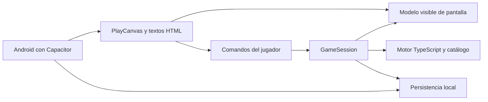

# T1 · Alcance y contrato de integración

Estado: línea base de ingeniería definida el 11 de septiembre de 2026. Decisiones de implementación adoptadas para avanzar; no equivalen a aprobación visual del autor. La interfaz que el autor aporte se integrará en T3/T4. T1 comprende especificación y auditoría piloto; las reparaciones del motor empiezan en T2.

## Producto comprometido

Una carrera narrativa individual de futbolista, desde los 18 años hasta su retirada y epílogo, en español, instalable en Android y jugable sin conexión. El jugador decide cómo compite, negocia, cuida su cuerpo y trata a las personas. El mundo simula consecuencias; cada elección debe describir una acción concreta y ofrecer información suficiente para entender qué está en juego.

La prioridad es funcionamiento y atractivo: continuidad de partida, decisiones comprensibles, consecuencias reconocibles y ganas de seguir. El volumen del catálogo no demuestra calidad. Las 388 escenas son alternativas del catálogo, no escenas que deban aparecer todas en una carrera. La duración se medirá en la demo; no se rellenará con esperas para alcanzar las ocho a catorce horas aspiracionales del guion.

| Área | Línea base Android v1 | Criterio de aceptación |
|---|---|---|
| Carrera | Seis tramos, retirada variable y cierre coherente | Llegar al epílogo desde creación, incluyendo rutas modestas y retirada sin último partido |
| Contenido | 254 principales y 134 condicionales reconciliados | Cada escena con fuente, elecciones específicas, disparadores, consecuencias y evidencia; desviaciones narrativas explícitas |
| Memoria | 210 semillas y 20 personajes definidos por el canon | Origen y consumidor/cierre de cada semilla; recuerdos y evolución según ruta, sin exigir que todos aparezcan |
| Partidos | Simulados, con resumen y momentos de decisión | Resultado deportivo separado de interpretación social; no garantizar gol por elegir lanzar |
| Presentación | 2D, texto, retratos y ambientación ligera | Lectura cómoda, controles táctiles y recursos opcionales con alternativa |
| Conexión | Recursos esenciales incluidos, sin cuenta de jugador | Crear, elegir, guardar, reanudar y terminar en modo avión |
| Guardado | Una carrera activa, copia anterior recuperable y exportación/importación local | Actualización, interrupción y fichero corrupto sin sobrescribir la última copia válida |
| Distribución | Google Play y estabilización | Versión publicada, actualización comprobada e incidencias graves resueltas |

Multijugador, partidos controlados en tiempo real, mundo 3D explorable, compras, anuncios, guardado en nube, doblaje integral, licencias reales, iOS y traducciones quedan fuera de esta línea base. Incorporarlos exige una estimación de pasadas y dependencias propia. Las exclusiones se revisan si el autor amplía el objetivo.

## Flujo de pantallas

Inicio/continuar → creación breve → carrera → escena → resultado → carrera. Desde carrera se abren estado, relaciones/historial y ajustes/guardado. Al retirarse: epílogo → nueva carrera con confirmación antes de sustituir la activa.

La pantalla de carrera reúne fecha, club, situación deportiva, mensajes y botón Continuar. La escena presenta situación, hechos conocidos, incertidumbre y elecciones específicas. El resultado muestra lo observado y permite continuar; los efectos ocultos aparecen cuando narrativamente se descubren. Los estados de carga, error de guardado y recuperación forman parte del flujo.

Orientación vertical como hipótesis inicial; texto ampliable y zonas táctiles de al menos 48 dp, sin fijar la identidad gráfica. La demo usará un fondo y hasta seis retratos de prueba reutilizables, sin vídeo obligatorio. Se evaluará con la interfaz del autor antes de producir el arte completo. Objetivos iniciales que T3 deberá medir: respuesta visual a pulsación p95 ≤100 ms; transición habitual p95 ≤200 ms; inicio frío offline ≤5 s en dispositivo de referencia. No son resultados ya obtenidos. El dispositivo y la muestra de medición se registran en T3.

## Decisión tecnológica

PlayCanvas es la opción principal para el editor online y la presentación. El núcleo TypeScript seguirá independiente. La envoltura Android propuesta es Capacitor con recursos locales. HTML/CSS puede resolver los textos y menús dentro de la aplicación web, con PlayCanvas para ambientación y escenas visuales. Esta arquitectura es una propuesta de integración; T0 no acreditó una aplicación funcional dentro del proyecto online del autor.

T3 ensayará una única escena completa antes de extender la interfaz. Si el prototipo no puede leer, guardar y reanudar correctamente en Android, se comparará una presentación web directa usando la misma sesión. Cambiar la presentación no debe obligar a reescribir el catálogo ni la simulación. Las fuentes técnicas verificadas permanecen en el informe T0.

## Contrato propuesto de GameSession para T2

La UI no llamará directamente a `scheduleEvent` ni a `resolveChoice`. Son operaciones de bajo nivel que consumen azar o modifican estado. La sesión será el único punto de escritura durante una partida interactiva; las consultas no consumirán RNG ni avanzarán el calendario.

| Operación | Entrada | Resultado y garantía |
|---|---|---|
| `create` | Semilla y opciones de creación validadas | Sesión inicial persistida; semilla independiente del reloj de simulación |
| `getView` | Ninguna | Copia del estado visible; repetible sin mutación |
| `continue` | ID de comando y revisión esperada | Avanza de forma acotada hasta decisión, resumen o cierre; persiste evento pendiente antes de mostrarlo |
| `choose` | ID de comando, revisión, instancia pendiente, elección | Valida, resuelve sobre copia, persiste una vez y presenta resultado |
| `acknowledgeResult` | ID de comando y revisión | Cierra resultado; no permite perderlo por suspensión o recarga |
| `resume` | Guardado local | Restaura escena o resultado sin seleccionar otra vez |
| `export` / `import` | Instantánea / fichero | Exporta estado confirmado; importa solo después de validar y preservar copia anterior |

La revisión aumenta solo con una mutación confirmada. Un comando repetido idéntico devuelve el recibo ya persistido; el mismo ID con un contenido diferente se rechaza. Un comando nuevo con revisión antigua se rechaza antes de tocar RNG. Se serializan operaciones concurrentes. El avance se limita por lote para poder devolver control al navegador; alcanzar ese límite produce estado de continuación, nunca retiro artificial ni bloqueo silencioso.

La unidad persistida incluye versión del contenedor de sesión, versión de esquema del motor, versión/hash del contenido, identificador de partida, revisión, estado completo con los cuatro RNG, evento pendiente con ID de instancia, resultado pendiente y recibos de comandos. La escena pendiente fija la versión de contenido que se mostró; si una actualización altera decisiones, requiere migración explícita o conservar la definición antigua. No se reinterpretará una elección antigua por coincidir su letra A/B/C/D.

Se puede conservar el esquema de motor 8 para campos existentes y versionar por separado el contenedor; cualquier modificación de su estructura exige migración probada. Los saves 3–7 ya ensayados se cargan mediante migración y validación final. La versión 2 se declarará compatible solo después de añadir una muestra verificable. Un save legado sin escena pendiente reanuda en el límite que realmente conserva, sin afirmar que recupera una escena que nunca guardó.

Para confirmar una elección: validar → clonar → resolver → validar resultado → escribir estado, recibo y vista de resultado juntos → confirmar revisión → notificar UI. Si falla la escritura, se conserva el estado confirmado, se muestra error y se permite reintentar. La persistencia web debe usar una transacción de IndexedDB; cualquier adaptador nativo deberá ofrecer garantía equivalente probada. La copia anterior y una exportación ayudan a recuperar datos, pero no prometen sobrevivir a desinstalar la app o borrar su almacenamiento.

`PlayerViewModel` expondrá únicamente fecha, contexto conocido, situación visible, textos, incertidumbre narrada, retratos y elecciones habilitadas. Excluye pesos de azar, condiciones ocultas, agendas privadas y resultados futuros. Debug/QA tendrá una entrada separada desactivada en distribución. Preferencias visuales no alteran los cuatro flujos aleatorios.

## Decisiones de dominio que T2 debe proteger

Contratos: el mundo puede generar ofertas o renovar bajo una delegación expresa y registrada; no firmará silenciosamente una decisión que corresponda al jugador. Decidir retirarse, anunciarlo y dejar de competir son estados distintos. Los hitos a 20/23/26/30/34 se conservan con los datos del cruce de edad; no se reescriben con el estado final. Un fichaje confirmado cambia club, inscripción, contrato y contexto juntos.

IDs: el inventario T1 distingue igualdad literal y posible equivalencia. Los tres candidatos del piloto no se convierten automáticamente en alias. Se conservarán identificadores históricos o migraciones explícitas; igual título no prueba igual significado. La etiqueta actual `verified` no bastará para dar por terminada una escena.

## Matriz mínima de aceptación

| ID | Prueba exigida | Etapa |
|---|---|---|
| S01 | Cien ciclos de guardar/cargar antes de elegir mantienen instancia, opciones y RNG | T2 |
| S02 | Doble pulsación, reintento tras recarga y comando concurrente producen un único efecto | T2 |
| S03 | Error inyectado al guardar conserva estado anterior; reintento no cambia outcome | T2 |
| S04 | Save truncado, campo esencial ausente, número no finito o versión futura se rechazan con recuperación | T2 |
| S05 | Consultar pantalla cien veces no altera estado ni RNG | T2 |
| S06 | Continuar y elegir siguen idénticos antes/después de migrar cada versión soportada | T2 |
| S07 | Oferta pendiente no modifica contrato; aceptación/rechazo tienen efecto comprobable | T2 |
| S08 | Hitos de edad conservan sus valores al completar la carrera | T2 |
| A01 | Misma secuencia y semilla producen misma historia en motor, navegador y Android | T3 |
| A02 | Modo avión, atrás, suspensión y recuperación preservan escena y resultado | T3/T7 |
| J01 | Al menos 80 % de 8–12 participantes explican qué decidieron y una consecuencia sin ayuda | T4 |
| J02 | Al menos 70 % quieren continuar voluntariamente tras la sesión; registrar causas y abandonos | T4 |
| J03 | Dos rondas de observación y mejora; criterio no superado obliga a revisar el ciclo | T4 |
| N01 | Cada escena revisada tiene caso de entrada válido/inválido, elecciones y consecuencias específicas | T4/T5 |
| N02 | Una cadena de memoria se crea, reaparece y se cierra sin contradicción tras recargar | T4/T5 |
| Q01 | Estados imposibles, rutas extremas y cierres sin último partido quedan cubiertos | T6 |
| A03 | Tres teléfonos físicos, actualización y cinco carreras humanas completas con incidencias registradas | T7 |

Las muestras humanas son validación formativa; no permiten predecir ventas ni retención poblacional. Sus resultados y los de teléfonos reales no se sustituirán por simulaciones.

## Dependencias y siguientes pasos

La interfaz definitiva, recursos con permiso de uso, dispositivos, participantes y datos de publicación se incorporan cuando corresponda. No bloquean T2. La falta de un dispositivo sí impide acreditar la instalación real de T3; se registra por separado la integración terminada y la comprobación pendiente.

La primera pasada de código será T2.1: base reproducible y GameSession con evento pendiente, consultas puras y comandos protegidos. Las siguientes completarán validación/migraciones, recuperación, contratos e hitos/gates. El repositorio y fijación de dependencias se trasladan de la antigua T1 a T2.1; T1 conserva los hashes de la fuente para identificar exactamente la base auditada.
